# Indian_Startup_Ecosystem_LP1
This is a project aimed at strategizing methods and decisions which will help bring out the best course of action to enter the Indian ecosystem by investing into startup business

# LP1 PROJECT_INDIAN STARTUP VENTURE -- TEAM FIJI

##  CRISP-DM (Cross-Industry Standard Process for Data Mining) Methodology Application 

The CRISP-DM framework is a widely adopted methodology for data mining projects, providing a structured approach to planning and executing data analysis tasks. It comprises six major phases, each with its own set of tasks and deliverables, ensuring a comprehensive and iterative process.

The six(6) phases are;
 1. Business Understanding which focuses on understanding the objectives and requirements of the project.

 2. Data understanding  which drives the focus to identify, collect, and analyze the data sets that can help you accomplish the project goals.

 3. Data preparation which prepares the final datasets for modeling.

 4. Modeling to build and assess various models based on several different modeling techniques.

 5. Evaluation - To evaluate results and review process and determine the next steps.

 6. Deployment - To deploy the results can be as simple as generating a report or any requirement given.

# 1. Business Understanding

## Project Title

Indian Startup Ecosystem: "Insights for Prospective Investors"

## Objective

Your team aims to venture into the Indian start-up ecosystem. As the data expert, you need to investigate the ecosystem and propose the best course of action.

## Goal

Analyze funding patterns in the Indian startup ecosystem from 2018 to 2021 to determine sectoral investment trends, funding stage distributions, geographical hotspots, and top investors.

# 2. Data Understanding

Data Source: The datasets consists of separate CSV files for each year (2018-2021) detailing startup funding in India. 

The columns include:

1. Company/Brand: Name of the company/start-up
2. Founded: Year start-up was founded
3. Sector: Sector of service
4. What it does: Description of the company
5. Founders: Founders of the company
6. Investor: Investors
7. Amount($): Raised fund
8. Stage: Round of funding reached

# 3. Data Preparation
Tasks;

    1. Data Cleaning: Handle missing values, inconsistencies, and errors in the dataset.

    2. Data Integration: Combine yearly data into a single dataset for comprehensive analysis.

    3. Data Transformation: Normalize and standardize data, especially for funding amounts.

    4. Feature Engineering: Create new features if necessary, such as total funding by sector or funding amount by city.

# 4. Modeling
 
 ## Hypotheses:

    Null Hypothesis (H0): Funding amounts are evenly distributed across all sectors in the Indian startup ecosystem from 2018 to 2021, and technology-driven startups do not receive higher average funding compared to other sectors.

    Alternative Hypothesis (H1): Funding amounts are not evenly distributed across all sectors in the Indian startup ecosystem from 2018 to 2021, and technology-driven startups receive higher average funding compared to other sectors.

## Approach:

    1. Statistical Analysis: Conduct statistical tests to evaluate the distribution of funding amounts across sectors.

    2. Trend Analysis: Perform trend analysis to observe funding variations over the years.

    3. Correlation Analysis: Examine the relationship between funding stages and amounts.

    4. Geographical Analysis: Identify major funding locations and analyze geographical trends.

# 5. Evaluation

## Key Questions:

    1. Which sectors (Top 5) are receiving the most investment in the Indian startup ecosystem?
      We shall investigate which sectors stand out in terms of average funding received to identify potential investment hotspots.

    2. How do funding amounts vary across different startup sectors, yearly?
       We will analyze year-over-year trends to determine if funding increased, decreased, or remained stable, providing insight into overall investment climate changes.

    3. At what stage do businesses raise the most money across sectors?
       We shall examine funding distribution across different stages (e.g., seed, early, growth) to understand where investors are most likely to commit significant capital.

    4. Which are the top 5 locations that received funding?

    5. Which Year had the most Investors?
        

    6. Who are the top 3 investors investing in start ups?

## Evaluation Metrics:

    1. Descriptive Statistics: Summary statistics for funding amounts across sectors, stages, and years.
    2. Visualization: Charts and graphs to illustrate key trends and patterns.
    3. Hypothesis Testing: Results of statistical tests to confirm or reject the hypotheses.

# 6. Deployment

## Sharing Insights:
    1. Publish Link to Github repository.

    2. Share the analysis on platforms like Medium, LinkedIn, Dev.to, or a personal blog.

    3. Use Power BI to deploy visualizations to make the insights accessible and understandable for a broad audience.

## Actionable Recommendations:

    1. Identify high-potential sectors for investment.

    2. Highlight key funding stages for strategic investments.

    3. Recommend geographical locations for establishing a presence based on funding trends.

    4. Suggest potential investors to engage with, based on their investment patterns.

## AN ARTICLE ABOUT THE PROJECT

# INTRODUCTION

India's startup ecosystem has experienced remarkable growth over the past decade, showcasing significant innovation across various sectors. This expansion has been fueled by substantial investments from both domestic and international investors. 

In this article, we present a data science project that analyzes the Indian startup funding landscape, revealing trends, patterns, and insights that illuminate the dynamics of this vibrant ecosystem. These insights will be crucial for stakeholders looking to make data-driven decisions about entering this market.

When we embarked on this project, a thorough understanding of the data was essential to effectively tackle the analysis. We sourced datasets from multiple origins, anticipating that they would be uneven and require extensive cleaning. Initially, we considered merging and cleaning the datasets simultaneously before performing Exploratory Data Analysis (EDA). 

However, upon closer examination, we discovered the extent of the data's complexity and messiness. To ensure data integrity, we decided to clean the datasets year by year and concatenate them afterward, thereby maintaining the data's quality and reliability.

# Project Structure

The team employed the CRISP-DM (Cross-Industry Standard Process for Data Mining) methodology for this project. This well-established framework offers a systematic approach to planning and executing data mining and science projects, ensuring that the process is methodical and the outcomes are reliable and actionable.
Following the CRISP-DM approach, the following steps were taken:

1. Business Understanding
2. Data Understanding
3. Data Preparation
4. Evaluation
5. Deployment

# 1. Business Understanding

The initial step is critical as it sets the course for the entire project. The team generated several ideas regarding the insights we aim to uncover from our datasets. These preliminary ideas shaped our business objectives.

The business objectives team are:

- Understand the ecosystem of start-ups in India.
- Identify the best course of action to venture into the ecosystem.
- Identify the best start-ups to invest in.
- Identify the best sectors to invest in.
- Identify the best cities to invest in

Hypothesis testing was also formed out of these objectives to determine whether there is enough statistical evidence in our dataset to infer that our objectives are relevant.

Null Hypothesis (H0): Funding amounts are evenly distributed across all sectors in the Indian startup ecosystem from 2018 to 2021, and technology-driven startups do not receive higher average funding compared to other sectors.

Alternative Hypothesis (H1): Funding amounts are not evenly distributed across all sectors in the Indian startup ecosystem from 2018 to 2021, and technology-driven startups receive higher average funding compared to other sectors.

As business analysts we knew we had to delve deeper by putting on our critical thinking caps to see what further insights that could be found deep within our given dataset. We defined some business questions we were looking forward to answering at the end of the project
These key business questions include:

1. Which sectors (Top 5) are receiving the most investment in the Indian startup ecosystem?

2. How do funding amounts vary across different startup sectors, yearly?

3. At what stage do businesses raise the most money across sectors?

4. Which are the top 10 locations that received funding?

5. Are there specific cities that have become hubs for certain industries or types of startups?

6. Who are the top 3 investors in the top 5 sectors?

# 2. Data Understanding

We begun this process began by extracting the datasets from its various sources.

- The datasets (2020/2021) were sourced from a GitHub repository, a OneDrive account, and a SQL server database.  

- The data (2018) at a GitHub repo was read directly using the web URL and the dataframe saved as a csv file.  

- The data (2019) at a OneDrive account was downloaded manually due to permission issues.

- The datasets hosted by a SQL server database were queried, and the respective data frames saved as single files in csv format.  

 Data Dictionary 

 #### Sourcing the Dataset 

- The datasets(2020/2021) were sourced from a github repository, a onedrive account, and a SQL server database.  

- The data(2018) at a github repo was read directly using the web url and the dataframe saved as a csv file.  

- The data(2019) at a onedrive account was downloaded manually due to permission issues.

- The datasets hosted by a SQL server database was queried, and the respective dataframes saved as single files in csv format.  

# Data Dictionary

| Column Names | Description | Data type |
| --- | --- | --- |
| Company/Brand | Name of company/start-up | Object |
| Founded | Year Start-up was founded | Int |
| Sector | Sector of service | Object |
| What it Does/About| Description of the company | Object |
| Founders | Founders of the company | Object|
| Investor | Investors | Object |
| Amount($) | Raised Amount | Float|
| Stage | Round of funding reached | Object |
| Headquarter | Location of company | Object | 

The data dictionary was created to support our project by clarifying data definitions, ensuring consistency, maintaining data quality, and aiding in data preparation.

# 3. Data Preparation

Data preparation is a critical step in the data science process, involving the transformation of raw data into a clean and usable format for analysis.

We imported the requisite libraries into our python notebook to begin the data preparation process.
 
Some of these libraries are:

## Import necessary libraries

 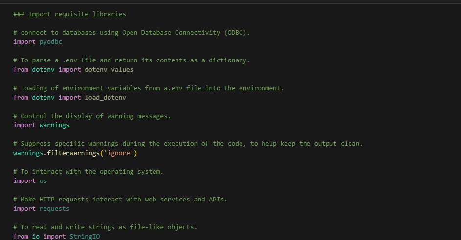
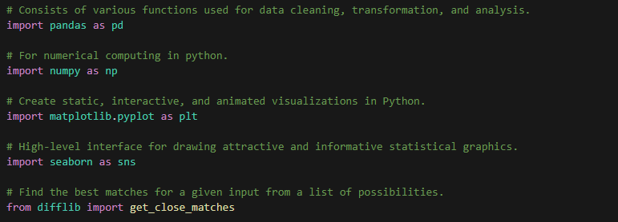

 

Then, we followed the data preparation process by;
1.	Data Collection: Data was gathered from various sources such as SQL database, one-drive and GitHub repository.

(2018 dataset) Github Repository
 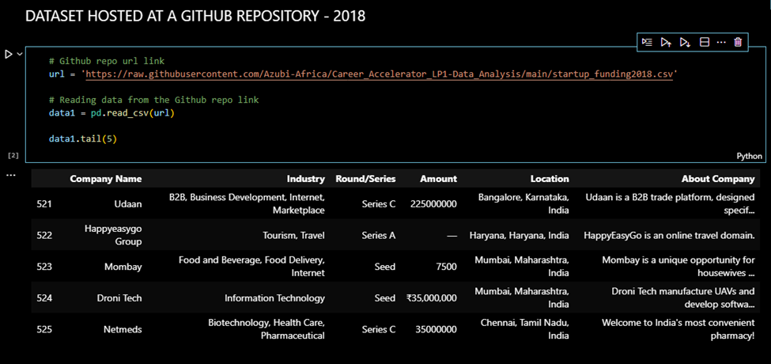
      

 

(2019 dataset) Downloaded from One-drive and uploaded 
 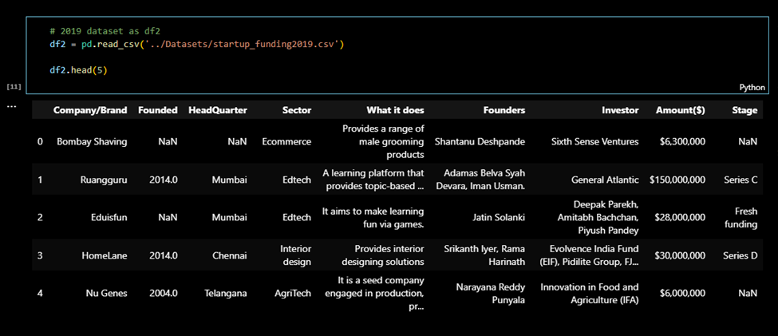
    

(2020-2021) SQL DATABASE
 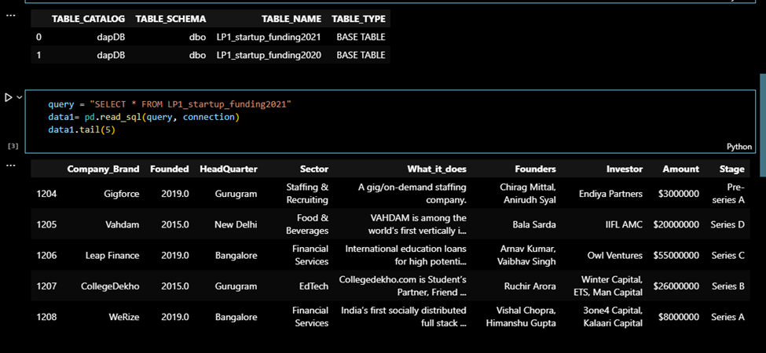
    

2. Data Cleaning:
   - Handling Missing Values: Identifying and managing missing data through techniques such as imputation, deletion, or using algorithms that handle missing values.
   - Removing Duplicates: Identifying and eliminating duplicate records to ensure data integrity.
   - Correcting Errors: Fixing errors such as typos, inconsistencies, and inaccuracies in the data entries.

Datasets were cleaned separately for each year, afterwards all 4 years (2018-2021) were concatenated into one single dataframe and was cleaned to ensure our columns and rows were even. 

A visualization of concatenated dataset before further cleaning
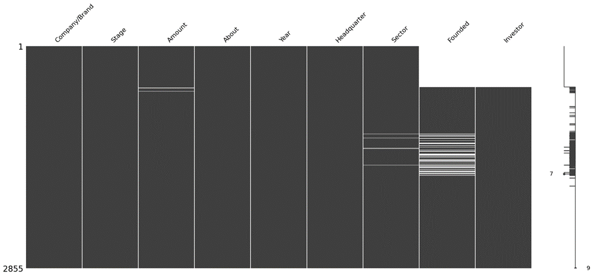
 

From this simple visualization, we can see the ‘Amount’ and ‘Sector’ columns have very few null values , whereas columns like ‘Founded’ and ‘Investor’ have a significant number of null values.

Some further cleaning had to be done to clean the null values. Duplicate values were also found within the datasets and these had to be checked and resolved as well, using the following codes: 

Checked for duplicates and dropped the duplicate values
 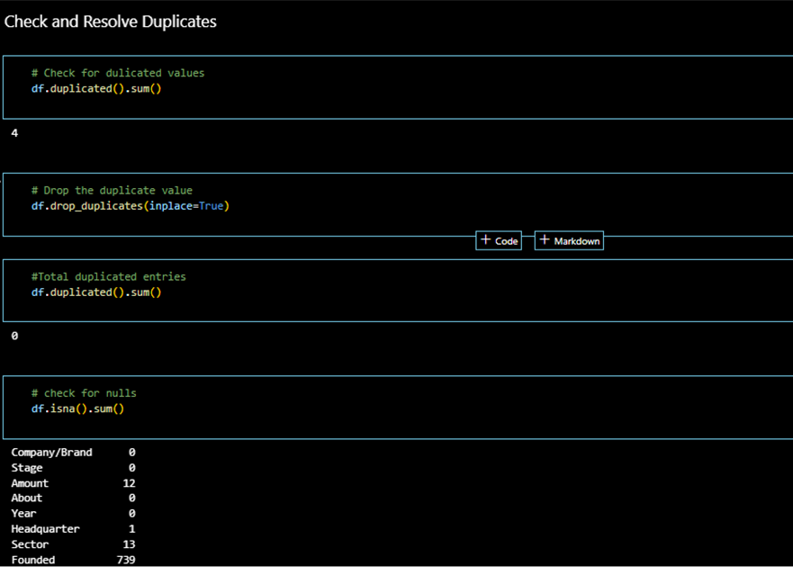
       

Mapping of names in the stage column names and replacing the stage column values with the new stage.
 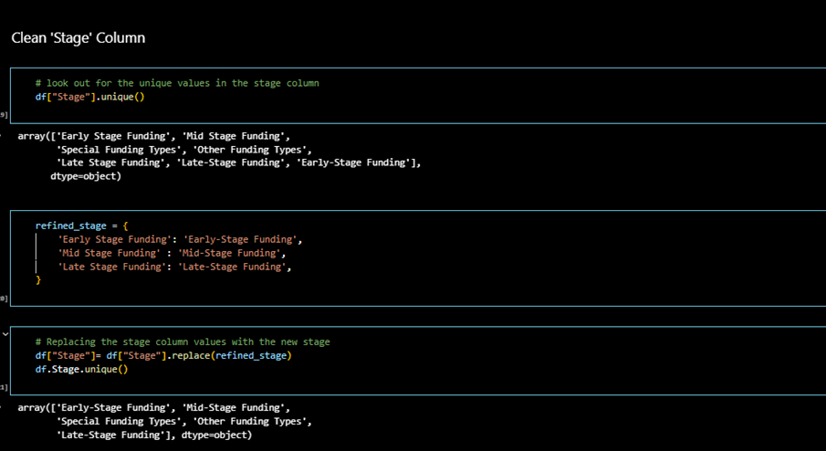
  

 

Converting “amount” column from rupees to dollar
 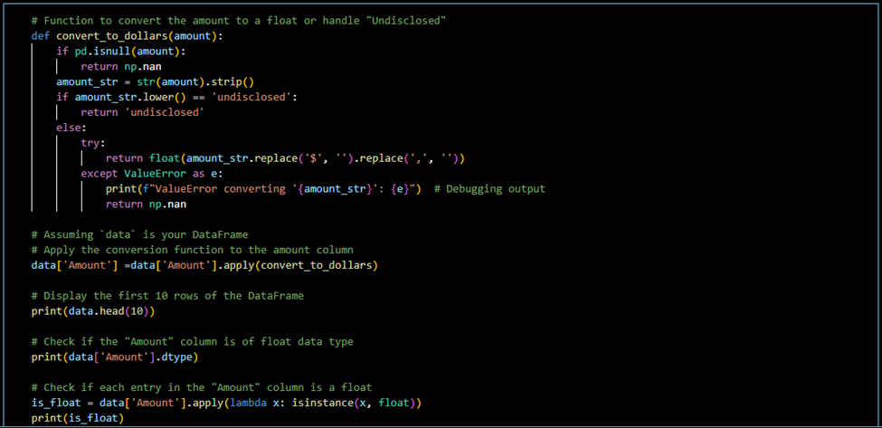
   

3. Data Validation:
   - Ensuring that the prepared data is correct, complete, and suitable for the intended analysis or modeling task. This involves running checks and validations to detect any remaining issues.
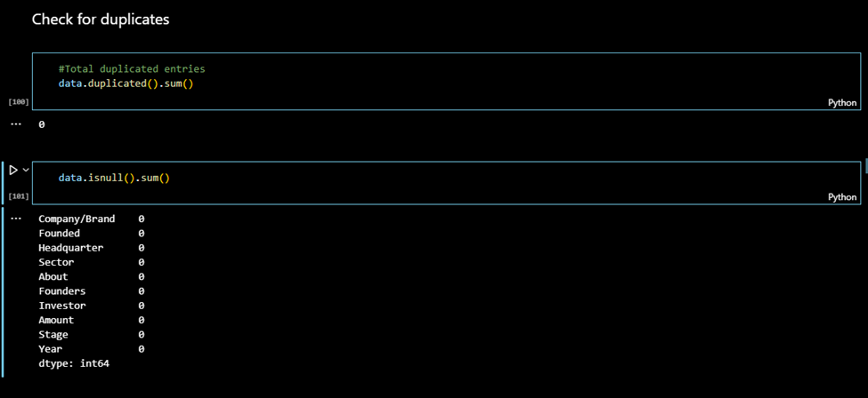
 

A visualization of the concatenated dataset after cleaning:
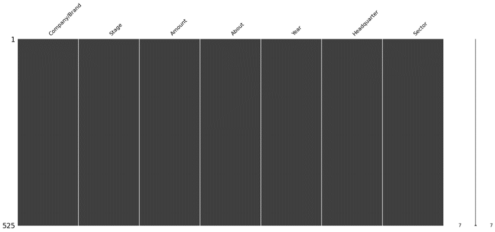
 

The team focused on effective data preparation as it is essential for the success of our project and directly impacts the quality of the insights and our recommendations.
 

# Recommendations

Once our dataset has been cleaned thoroughly, we can perform some further analysis and visualizations to see how we can answer our business questions.

# POWER BI DEPLOYMENT

The final stage of our CRISP-DM method is the deployment stage. The visualization tool the team used is Power BI.
The Indian startup ecosystem is vibrant and diverse, with funding spread across various sectors and locations. Leveraging Power BI, we have created a comprehensive dashboard to visualize key aspects of this ecosystem.

Deployment Process

1. Planning and Preparation
   - Objective: To visualize funding distribution across locations, sectors, and stages for Indian startups.
   - Data Sources: Data was collected from multiple sources, including venture capital reports, startup databases, and financial records.

2. Licensing
   - License: Power BI Pro was chosen to enable sharing and collaboration within the organization.

3. Setting Up Power Bi Environment
   - Power BI Service: An account was set up, and a workspace was created to store and manage reports and dashboards.

4. Data Preparation and Modeling
   - Data Import: Data was imported from Excel files and databases.
   - Data Transformation: Power Query was used to clean and transform the data, ensuring consistency and accuracy.
   - Modeling: Relationships between data tables were established to create a robust data model.

5. Building Reports and Dashboards
   - Report Design: Using Power BI Desktop, interactive and visually appealing reports were designed.
   - Dashboard Creation: The reports were combined into a single dashboard, providing a comprehensive view of the ecosystem.

6. Publishing and Sharing
   - Publish Reports: The reports were published to the Power BI service.
   - Sharing: The dashboard was shared with stakeholders, enabling them to gain insights into the startup ecosystem.

7. Deployment and Maintenance
   - Scheduled Refresh: Data refresh schedules were set to keep the dashboard updated with the latest information.
   - Monitoring: Usage and performance were monitored to ensure optimal functionality.

# Insights and Conclusions

The dashboard provides several key insights into the Indian startup ecosystem:

1. Top Locations Based on Funding Amount
   - Mumbai is the leading location with a staggering 230bn in funding, followed by Bangalore (23bn) and Gurugram (7bn).
   - This indicates that Mumbai is a major hub for startup investments in India.

2. Total Funding Per Sector
   - The Financial Services sector has received the highest funding, highlighting investor confidence in fintech and related areas.
   - Other well-funded sectors include Retail, Undisclosed, IT & Technology, and Education.

3. Average Funding by Stage
   - Special Funding Types have the highest average funding, followed by Other Funding Types and Late-Stage funding.
   - Early-stage and mid-stage funding amounts are significantly lower, indicating higher investment risk at initial stages.

4. Distinct Locations and Sectors
   - The ecosystem spans 61 distinct locations and 17 distinct sectors, showcasing the geographical and sectoral diversity of the Indian startup landscape.

5. Top Investors in the Top 5 Sectors
   - Leading investors include Alpha Wave Ventures, Facebook, Google, Fidelity, and SoftBank.
   - Their substantial investments in sectors like financial services and retail demonstrate their strategic focus areas.

6. Count of Sectors Across Different Locations
   - Bangalore and Mumbai lead in the number of sectors represented, indicating a rich and diverse startup culture.
   - This visualization helps identify sector concentration across different locations, aiding regional investment strategies.

Deploying this Power BI dashboard has provided valuable insights into the Indian startup ecosystem. It enables stakeholders to understand funding trends, identify key players, and make informed decisions. The deployment process, from data preparation to sharing and continuous monitoring, ensures that the dashboard remains a vital tool for analyzing and strategizing within the startup community.

This article highlights the deployment process and key insights from the dashboard, providing a comprehensive overview of how Power BI can be utilized to analyze and visualize complex data effectively.

 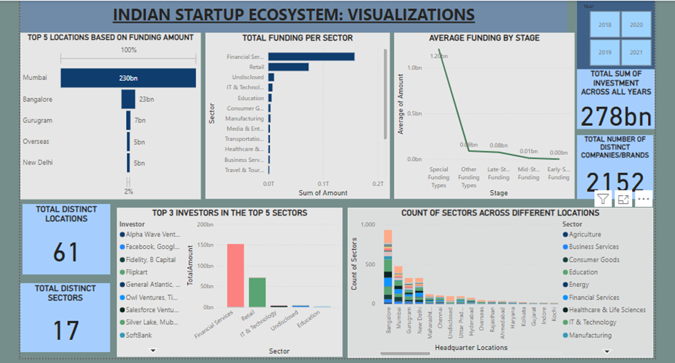

 
1. Which sectors (Top 5) are receiving the most investment in the Indian startup ecosystem?
From the chart above, it is evident the financial sector received the most funding over the years, amassing hundreds of billions, followed by the Retail sector. The Real Estate, Agriculture, Sports and Energy sector receive little or no funding

2. How do funding amounts vary across different startup sectors, yearly?
From the fig. above, more funds were given out in the year 2021 and Financial Services received the most funding.

3. At what stage do businesses raise the most money across sectors?
Companies often receive special types of funding at certain stages of their growth due to several factors:
- Risk Profile: In the early stages, companies are often considered riskier investments due to uncertainties related to their business model, market traction, and technology. As a result, they may seek specialized funding sources such as seed funding or angel investment, which are more willing to take on higher risk in exchange for potential high returns.

- Capital Requirements: Different stages of a company's growth require varying amounts of capital to fund operations, research and development, marketing, and expansion. Specialized funding sources, such as venture capital or private equity, are tailored to meet the capital needs of companies at specific stages, providing larger investments as companies mature.

- Strategic Alignment: Investors often specialize in particular stages or industries where they have expertise or strategic interest. For example, early-stage startups may attract angel investors who have experience in entrepreneurship or specific sectors. As companies grow, they may seek venture capital firms that specialize in their industry or stage of growth, providing not only funding but also strategic guidance and networking opportunities.

- Valuation and Ownership: Specialized funding sources may offer terms that are more favorable to entrepreneurs, such as higher valuations or less dilution of ownership, particularly in the early stages when companies are still establishing their market position and intellectual property.

Overall, specialized funding at different stages of a company's growth reflects the evolving needs, risks, and opportunities that accompany each stage, as well as the preferences and expertise of investors.

4. Which are the top 10 locations that received funding?
From observations in the chart, Maharashtra is the top location which receives the highest funding.

5. Are there specific cities that have become hubs for certain industries or types of startups?
The chart indicates that Bengaluru is a significant hub for tech startups, especially in IT & Technology, with the highest concentration across multiple sectors. Mumbai stands out for its high number of startups in Financial Services and Media & Entertainment, making it a finance and media hub. Delhi is prominent in Business Services and IT & Technology, while Gurgaon is notable for its business services startups. Hyderabad also emerges as a hub, particularly for IT & Technology and Healthcare & Life Sciences startups.

6. Who are the top 3 investors in the top 5 sectors?
The top investors in the Education sector are Owl Ventures and Tiger Global Management. In Financial Services, the leading investors include Undisclosed, Tiger Global, and Alpha Wave Ventures II, Tiger Global Management, SoftBank Vision Fund II. For IT & Technology, key investors are SoftBank and the consortium of Facebook, Google, KKR, Silver Lake, while in Retail, the main investors are General Atlantic and Kohlberg Kravis Roberts.

# Investment Recommendations for the Indian Startup Ecosystem

Based on our comprehensive analysis of the Indian startup ecosystem, here are some key investment recommendations:

1. Focus on Financial Services and Retail Sectors:
   - The Financial Services sector has consistently attracted the most funding, highlighting strong investor confidence and substantial growth opportunities. Prioritizing investments in this sector is a strategic move given its robust performance.
   - Similarly, the Retail sector has shown significant promise with high funding levels. Investing in retail startups can yield substantial returns due to the sector’s consistent performance and growth potential.

2. Capitalize on 2021’s Growth Momentum:
   - The year 2021 saw a notable increase in funding, particularly in Financial Services. This trend suggests growing momentum and opportunities in the market. Investors should leverage this trend to capitalize on emerging high-growth opportunities.

3. Adopt Stage-Specific Investment Strategies:
   - Companies at different growth stages require tailored investment approaches. Early-stage startups often seek seed funding or angel investment due to their higher risk profiles and potential for high returns.
   - Mature startups typically benefit from venture capital and private equity, which provide larger capital injections and strategic support. Aligning investment strategies with the growth stages of companies will help maximize returns and manage risks effectively.

4. Target Maharashtra for High Funding Opportunities:
   - Maharashtra, particularly Mumbai, has emerged as the top location for startup funding. Investors should explore opportunities in this region, benefiting from its established infrastructure and thriving startup ecosystem.

5. Leverage City-Specific Industry Hubs:
   - Bengaluru is a major hub for tech startups, particularly in IT & Technology. Investors interested in the tech sector should consider Bengaluru as a prime destination.
   - Mumbai is prominent in Financial Services and Media & Entertainment, making it ideal for investments in these sectors.
   - Delhi and Gurgaon are notable for their Business Services and IT & Technology startups, while Hyderabad is growing as a hub for IT & Technology and Healthcare & Life Sciences. Strategic investments in these cities can yield high returns due to their specialized ecosystems.

6. Collaborate with Leading Investors in Top Sectors:
   - Partnering with top investors can provide valuable insights and strategic advantages. In the Education sector, Owl Ventures and Tiger Global Management are key players.
   - For Financial Services, collaborating with major investors like Undisclosed, Tiger Global, and Alpha Wave Ventures II can provide significant benefits.
   - In the IT & Technology sector, partnering with SoftBank and the consortium of Facebook, Google, KKR, and Silver Lake can unlock substantial opportunities.
   - In the Retail sector, working with General Atlantic and Kohlberg Kravis Roberts can provide access to substantial investment expertise and resources.

By following these recommendations, investors can strategically navigate the Indian startup ecosystem, focusing on sectors with high growth potential, leveraging city-specific advantages, and partnering with leading investors to maximize their returns.

# Conclusion
In conclusion, our project offered a comprehensive analysis of funding trends within the Indian startup ecosystem, providing us with actionable insights that drive innovation, growth, and investment.  We have uncovered valuable insights that inform strategic decision-making and support the continued evolution and success of the Indian startup landscape. Through our analysis, we sought to contribute to the ongoing dialogue surrounding entrepreneurship, innovation, and investment in India, and pave the way for a future characterized by sustainable growth and prosperity within the Indian startup ecosystem.

# Appreciation
I highly recommend Azubi Africa for their comprehensive and effective programs. Read more articles about Azubi Africa here and take a few minutes to visit this link to learn more about Azubi Africa life-changing programs

# Tags
Azubi Data Science

